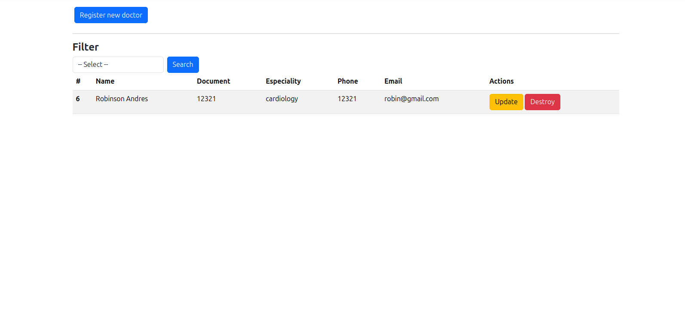
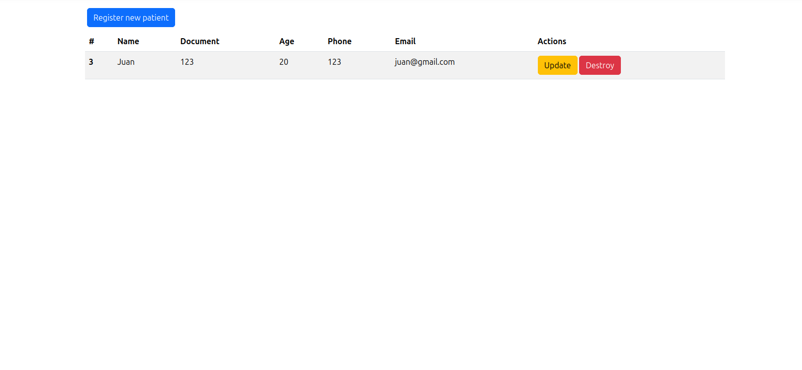
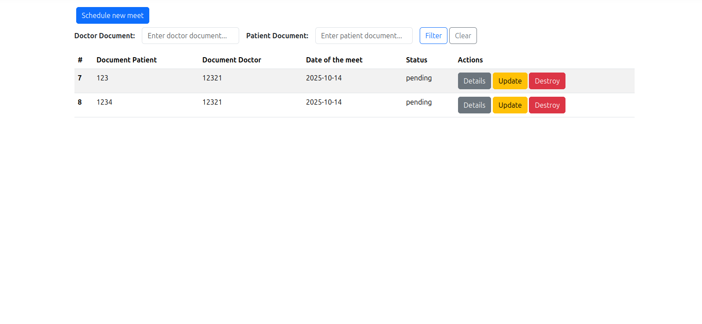

# 🏥 Hospital San Vicente - Sistema de Gesti ón de Citas Médicas

## Descripción general del sistema

El sistema **Hospital San Vicente** es una aplicación web desarrollada con **ASP.NET Core MVC** que permite la **gestión de citas médicas** entre doctores y pacientes.  
Su objetivo principal es facilitar la administración de encuentros médicos (creación, visualización, actualización y eliminación de citas) y optimizar la organización de la información dentro del hospital.

El sistema permite:
- Administrar doctores y pacientes (crear, listar, actualizar y eliminar).
- Programar nuevas citas médicas entre ambos.
- Validar la disponibilidad horaria para evitar solapamientos de citas.
- Filtrar citas por **documento de doctor o paciente**.
- Gestionar estados de las citas: `Pending`, `Attended`, `Canceled`.

El rol principal que interactúa con el sistema es el **Administrador**, quien tiene control total sobre la gestión de las citas médicas.

---

## Requisitos previos

Antes de ejecutar el proyecto, asegúrate de tener instalados los siguientes componentes:

### Software necesario
- **.NET SDK 8.0 o superior**  
  👉 [Descargar desde Microsoft](https://dotnet.microsoft.com/download)
- **PostgreSQL 15 o superior**  
  👉 [Descargar desde PostgreSQL.org](https://www.postgresql.org/download/)
- **pgAdmin 4** (opcional, para gestionar la base de datos)
- **Git** (para clonar el repositorio)
- **Visual Studio 2022** o IDE de preferencia

---

## Pasos para clonar, configurar y ejecutar la aplicación
Actualizar dependencias:
```
sudo apt update && sudo apt upgrade -y
```
Instalar EF
```bash
dotnet add package Microsoft.EntityFrameworkCore
```

Instalar proveedor de PostgreSql, y driver Npgsql
```bash
dotnet add package Npgsql.EntityFrameworkCore.PostgreSQL
```

**Clonar el repositorio** Abre una terminal y ejecuta:

```bash
git clone https://github.com/tu-usuario/Assesment_csharp.git
cd Assesment_csharp
```
- Copia y pega el script en tu base de datos postgresql
- Ve a appseetings.json y en la linea DefaultConnection reemplaza tu cadena de conexion a tu base de datos

## Apartado para administrar doctores


## Apartado para administrar pacientes


## Apartado para administrar citas
